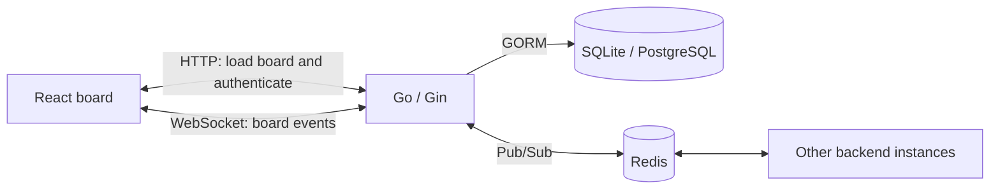

# Collaborative Kanban Board

A task board for small teams: organize work, move cards between stages, and see changes across connected browsers without refreshing.

**React + TypeScript · Go + Gin · WebSocket · GORM · Redis Pub/Sub**


## Try it in 60 seconds

Start the app using the instructions below, then open **http://localhost**.

1. Click **Try a demo — no sign-up**. A new board opens with five sample tasks across Product and Engineering.
2. Drag “Drag this card into DOING” into the DOING column.
3. Open the same board URL in a second tab and watch a move appear in both views.
4. Open a card to explore descriptions and tags.

Each demo creates a separate board rather than modifying a shared sample. Guest sessions are temporary; use sample data. A hosted demo URL has not yet been configured in this repository.

## What to explore

- **Live collaboration:** WebSocket events update connected clients; Redis Pub/Sub distributes board events between backend instances.
- **Board organization:** draggable cards, custom columns, swimlanes, tags, due dates and checklists.
- **Access control:** owner, editor and viewer roles, invite links, and access requests.
- **Connection recovery:** mutations are blocked while disconnected or refreshing. Reconnect fetches server state; server error messages trigger a refresh to reconcile optimistic changes.
- **Guest demo:** a populated board without Google sign-in. Google OAuth is available when configured.


Screenshots show the existing interface; the new demo entry and connection messages may differ.

## Architecture



For a card move, `Board.tsx` calculates its destination and position. `useWebSocket.ts` sends a `MOVE_CARD` event before applying an optimistic local update. The Go WebSocket handler checks permissions and updates the database, then the hub distributes the event to clients in that board room.

Redis distributes events; the database stores durable board data. If Redis is unavailable at startup, the hub supports local in-memory broadcasting.

## Run locally with Docker

Requirements: Docker with Compose.

```bash
cp .env.example .env
# Replace JWT_SECRET in .env with your own random value (at least 32 characters).
docker compose up --build
```

Open **http://localhost**. Google credentials are optional for the guest demo. For Google login, configure the OAuth credentials and URLs for your environment.

The production frontend uses the same-origin NGINX proxy for API and WebSocket connections. Separate hosting can override `VITE_API_URL` and `VITE_WS_URL` at build time. Configure the backend's allowed origins to match your public frontend.

## Run without Docker

Requirements: Node.js 22.12+ and Go 1.26.5 (as declared in `backend/go.mod`). Redis is optional for a single local backend.

```bash
cp .env.example backend/.env
# Set JWT_SECRET in backend/.env.
cd backend
go run .
```

In another terminal:

```bash
cd frontend
npm ci
npm run dev
```

Open **http://localhost:5173**. The development frontend defaults to the backend at port 8080.

## Validation

```bash
cd frontend
npm test
npm run build
```

```bash
cd backend
go test ./...
```

Frontend regression tests simulate disconnected edits, a send failure, reconnection and server rejection. Backend tests cover WebSocket broadcasting, positioning, permissions and demo creation, including transaction rollback. See [manual demo checks](docs/portfolio-case-study.md#manual-demo-checks) for browser-level validation.

## Engineering notes and limitations

- Local `WebSocket.send()` success is not proof that the database committed a change. The current protocol has no per-mutation acknowledgement or durable offline queue.
- Connection recovery reloads server state. Users must retry changes that were not sent; the app does not silently replay them.
- Redis Pub/Sub alone does not make every feature multi-instance ready. WebSocket tickets and online presence are held in process memory; multi-instance deployment needs further design and validation.
- Concurrent editing and event/snapshot ordering need further testing before claiming strong consistency or production scale.

Read the [connection recovery case study](docs/portfolio-case-study.md) for the concrete problem, implementation and interview discussion points.

## Development approach

This project was built with extensive AI assistance. Repository features describe implementation, not evidence that every design decision was independently authored or tested at production scale. The case study and regression tests make specific changes inspectable and provide material for explaining and validating the code.

## Code map

| File | Responsibility |
|---|---|
| `frontend/src/pages/Board.tsx` | Board UI and drag-and-drop |
| `frontend/src/pages/Dashboard.tsx` | Board list and demo entry |
| `frontend/src/useWebSocket.ts` | Connection, board state and mutations |
| `backend/client.go` | WebSocket validation, permissions and mutations |
| `backend/hub.go` | Board rooms and event broadcasting |
| `backend/models.go` | Data models and role resolution |
| `backend/demo.go` | Transactional board and demo creation |
| `backend/auth.go` | Authentication |

## Database startup troubleshooting

When `DATABASE_URL` or `DB_HOST` is set, the backend requires that PostgreSQL connection to succeed. It exits on failure instead of switching to an unrelated SQLite database. SQLite is selected only when neither variable is set.

For Render, copy the current connection URL from the database's Connect menu into the backend service's `DATABASE_URL`. Internal URLs require the service and database to be in the same account and region. Otherwise use the external URL with TLS. A `no such host` error indicates name resolution failed; confirm the database exists, is available, and the URL is current before changing credentials. Environment variables configured in Render do not require a `.env` file.
