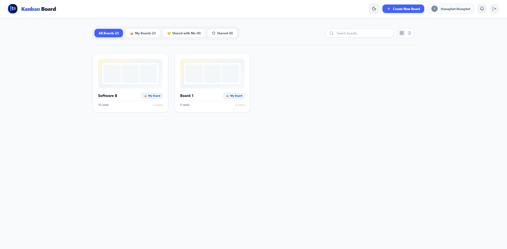
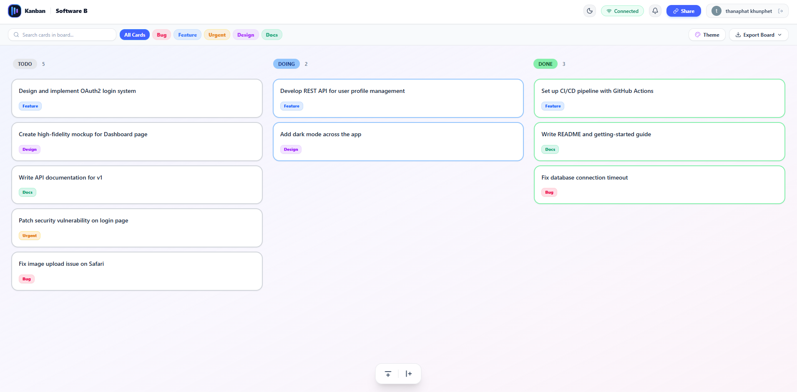

# Kanban Board

A real-time collaborative kanban board built with a Go backend and a React + TypeScript frontend. Cards, columns, and swimlanes sync instantly across everyone connected to a board over WebSockets, and Redis Pub/Sub is used so it can scale across multiple backend instances.

## Preview

### Dashboard


### Kanban Board


## Features

**Real-time sync**
- Card moves, column changes, swimlane edits, and tag updates all push to every connected client immediately.
- Card IDs are deduplicated between client and server so drag-and-drop doesn't create duplicate cards when multiple people move things at once.
- Online user avatars show up on the board and dashboard, and stale guest sessions get filtered out so they don't linger.

**Auth & guest mode**
- Logged-in users authenticate via Google OAuth (JWT stored in `localStorage`). Guests get a temporary session stored in `sessionStorage` that clears when the tab closes.
- If a guest signs in with Google partway through, their board gets automatically reassigned to their account instead of being lost.
- Guests can't claim or overwrite boards that already belong to someone else.

**Leaving the board cleanly**
- If a guest hits the browser back button, we intercept it (`popstate`) and ask if they want to save the board before leaving.
- If they just close the tab, a `DELETE` request fires with `keepalive: true` so the board gets cleaned up even without a proper page unload.
- A background worker also runs hourly and clears out any guest boards older than 24 hours, as a backstop.

**Permissions**
- Three roles: Owner, Editor, Viewer.
- Guests have to log in with Google before they can request editor access — keeps random anonymous requests out.
- Owners get a panel to approve, upgrade, or downgrade anyone's access.

**Task details**
- Click into a card to see the description, due date, swimlane, and checklist.
- Checklists show progress as you go (e.g. `2/4 - 67%`).
- Modal buttons change label depending on whether you're viewing or editing as a guest.

## Stack

- **Frontend:** React 19, TypeScript, Vite, Tailwind, Lucide icons
- **Backend:** Go 1.23+, Gin, GORM
- **Real-time:** WebSockets, Redis 7 Pub/Sub for cross-instance broadcasting
- **Database:** SQLite by default, Postgres also supported
- **Deployment:** Docker Compose, NGINX as reverse proxy / SPA router

## Running it

Easiest way is Docker Compose — spins up backend, frontend, NGINX, and Redis together:

```bash
git clone https://github.com/sing198/Kanban-Board.git
cd Kanban-Board
docker-compose up -d --build
```

Then open `http://localhost` (or `http://localhost:5173` if you're hitting the frontend dev server directly). The API runs on `http://localhost:8080`.

### Running locally without Docker

**Backend**
```bash
cd backend
cp .env.example .env
go run .
```
Runs on `http://localhost:8080`.

**Frontend**
```bash
cd frontend
npm install
npm run dev
```
Runs on `http://localhost:5173`.

## Project layout

```
kanban-board/
├── backend/
│   ├── auth.go              # OAuth + guest auth, board claiming
│   ├── client.go            # WebSocket client, origin checks
│   ├── hub.go                # WebSocket hub, Redis pub/sub
│   ├── main.go                # routes, rate limiter, cleanup worker
│   ├── models.go             # GORM models
│   ├── rate_limiter_test.go
│   └── Dockerfile
├── frontend/
│   ├── src/
│   │   ├── pages/
│   │   │   ├── Board.tsx      # board view, popstate/unload handling
│   │   │   └── Dashboard.tsx  # board list/grid, access requests
│   │   ├── useWebSocket.ts
│   │   ├── useAuth.ts
│   │   └── config.ts
│   ├── nginx.conf
│   └── Dockerfile
├── docker-compose.yml
└── README.md
```

## License

MIT — see `LICENSE`.