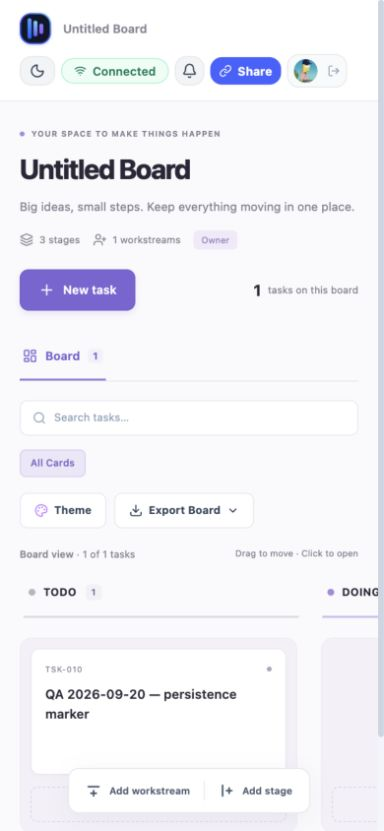

# Deployment validation — 20–22 September 2026

Target: https://kanban-board-eta-five.vercel.app/

## Release identity

The public site was inspected in a real browser. Its Dashboard still uses the earlier blue header and its Board uses “stages/workstreams”; the current local source uses shared workspace chrome and “columns/swimlanes”. Render showed backend commit `b97531dfa8c3fe34b6de7d3a2587b2cbee8d785d` as the last successfully deployed commit during the restart test on 20 September. The exact frontend commit remains unverified. Do not describe the new local features as released based on this report.

## Evidence and results

| Check | Result | Evidence / limit |
|---|---|---|
| Home page over HTTPS | Passed | Login and guest-demo buttons rendered. |
| Google login | Passed for existing Google session | Clicking Continue with Google returned an authenticated Dashboard. No credential was requested by the agent. Fresh consent/MFA paths were not exercised. |
| Authenticated board creation | Passed | Created an isolated QA board and reached Connected / Owner. |
| Save and reload | Passed | `QA 2026-09-20 — persistence marker` remained in TODO after browser reload; TSK-010. |
| Share dialog | Partial | Can edit and Can view options generate distinct links. Invite credentials deliberately omitted from this report and screenshots. |
| Viewer/editor enforcement | Not verified on production | A second independent authenticated identity is needed. Testing as the owner would not establish viewer restrictions. Local automated role checks are separate evidence. |
| Mobile layout | Partial pass | 390 × 844 viewport, measured page width 384px. Header, task and create controls visible; board columns scroll horizontally. Physical touch devices and all dialogs not covered. |
| Data after backend restart | Passed for the QA board | Render Events confirmed “Service restarted by you” on 20 September 2026 at 10:05 PM (dashboard-displayed time). After restart and reload, TSK-010 remained in TODO and the board returned to Connected / Owner. |
| Writes after restart | Passed | Created TSK-011, `QA 2026-09-20 — post-restart write`, after the restart. A fresh reload on 22 September returned both markers in TODO (2 tasks), Connected / Owner. |
| Latest local changes deployed | Not verified | Visible public UI differs from local source. |

QA board: https://kanban-board-eta-five.vercel.app/b/790be336-8aec-45bc-a5e7-18c56e4508fa

The QA board was retained for restart testing. It contains two test markers, not real task data. This verifies one application-service restart and subsequent writes; database restart, host replacement, backup recovery and disaster recovery were not tested.

## Complete the remaining checks

1. Record the frontend commit and recheck the backend commit at release time; deploy compatible versions together when releasing the new mutation protocol.
2. Use a second account in an isolated browser session. Open a view invite and verify no mutation controls; verify the server rejects writes. Open an edit invite and create/move a uniquely named test task; confirm it arrives in the owner's window. Test revoked/private access as well.
3. Repeat the restart/persistence test when releasing the latest local build; the completed test above covers the deployed baseline, not the newer local mutation protocol.
4. Confirm database URL, persistent storage, stable JWT signing configuration and OAuth callback settings in hosting controls without copying secrets into documentation.
5. Repeat at mobile widths and, separately, on an actual phone. Record browser/device and failures.

A test is passed only with observed evidence; unchecked steps above are a plan, not a claim of completion.

Backend control: https://dashboard.render.com/web/srv-d9mdgptbedkc73dgjl60 (authentication required).
