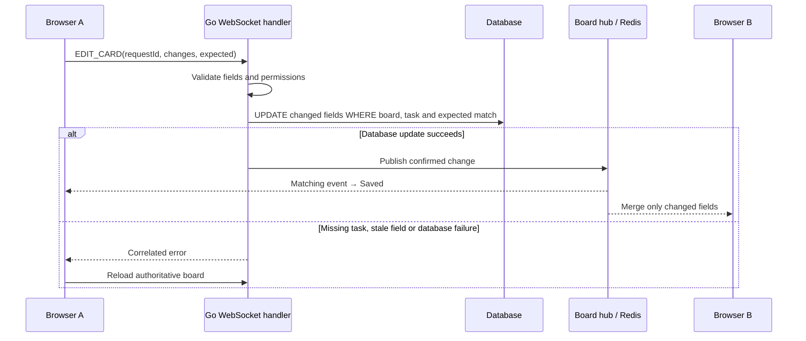

# Case study: trustworthy realtime task updates

## Problem and implementation

A fast optimistic interface can show a change that was never stored. The earlier code also sent entire task details, allowing a rename to overwrite someone else's description. Missing boards looked like a connection failure and retried indefinitely.

The current implementation sends task mutations with request IDs, checks database results before publishing success, and matches the acknowledgement to the initiating client. Disconnected edits are blocked. A failed or rejected change can be retried; a send with an unknown outcome is not automatically replayed.

`EDIT_CARD` now sends only changed fields plus expected prior values. The backend builds an update restricted to the task and board, adding comparisons for those fields. Editing different fields preserves both changes. Editing the same field from an old value is rejected instead of silently overwriting it. Explicit empty values can clear fields. This is optimistic concurrency control, not CRDT merging.

HTTP 403/404 stop automatic reconnect and render a useful recovery page. The UI provides a six-second pre-send deletion window, native task-move selectors, keyboard focus handling and live avatars.

## Follow one change

## Why these choices?

| Choice | Reason | Cost / limit |
|---|---|---|
| Optimistic UI | Keep drag and edits responsive | Must reconcile rejected writes and show uncertain outcomes honestly. |
| Per-field expected values | Prevent stale overwrites without a revision migration | No general merge for move ordering or simultaneous checklist-item edits. |
| Six-second delayed deletion | Undo keeps the original task and ID | It is not a trash/recovery feature after deletion is committed. |
| Native move selectors | Keyboard and non-drag alternative | Requires opening task details. |
| PostgreSQL fail-fast | Avoid quietly writing to a different database | A bad database configuration stops startup until corrected. |
| Single-instance presence | Simple and testable for a portfolio deployment | Redis event delivery alone does not synchronize presence or tickets. |

## Validation evidence

- Local frontend: 18 tests plus TypeScript and build passed during the latest implementation work.
- Backend: `go test ./...` passed, including real WebSocket clients, two-user lifecycle, presence deduplication, field patch preservation and stale-write rejection.
- Local browsers: cross-tab create/move, avatars joining/leaving, save feedback, Undo and missing-board screen observed.
- Production: Google login with an existing session, board creation, save/reload and a mobile-width layout observed. A real Render backend restart preserved the QA marker, and a post-restart write survived reload (rechecked 22 September). Independent viewer/editor enforcement remains unverified: [deployment report](deployment-validation.md).

Automated sockets and local SQLite do not substitute for testing the public PostgreSQL deployment.

## Manual demo checks

1. Start a guest demo with five tasks and two swimlanes.
2. Open its URL in a second browser. Create/move a task and check the other view without refresh; observe presence.
3. Open a task with the keyboard. Move it using Column/Swimlane. Escape closes the dialog.
4. Delete a test task and use Undo before six seconds pass. Confirm the original description/checklist remain.
5. Disconnect the backend: edits must not claim Saved. Reconnect and inspect authoritative state.
6. Have two editors change different fields, then try competing edits to the same field from stale drafts. Confirm preservation/rejection respectively.
7. Open a deleted board link: it must show Board not found rather than endless reconnect.

## Interview practice

Trace the code while answering, and demonstrate each claim:

- What is the difference between `WebSocket.send()` succeeding and the database committing?
- How does a request ID prevent another user's event from being mistaken for your save?
- Show the SQL condition that rejects a stale edit. Why not lock the whole board?
- What happens if the server commits but the acknowledgement is lost?
- Which parts are durable, and which disappear on restart? What is Redis actually responsible for?
- Why can one Google owner account not prove that viewer permissions work?
- Which limits would you address before adding backend replicas?

## AI-assisted development

This project was built with extensive AI assistance. Explain what was generated, what you inspected, and what you personally reproduced. Do not claim independent authorship, production-scale testing or mastery of decisions you cannot trace through the code. Use the changes, tests and known limitations as concrete study material.
